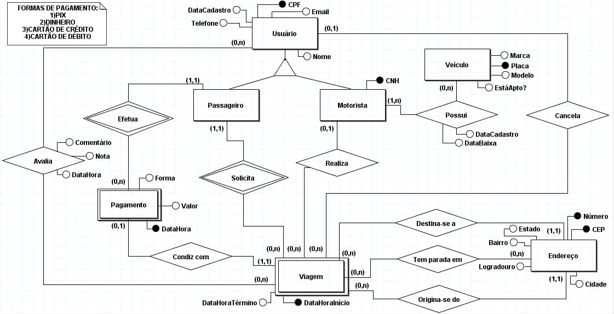

# 🚍 Banco de Dados - App de Transporte

Projeto desenvolvido para a disciplina de **Modelo Conceitual e Relacional**.

O projeto consiste na modelagem de um banco de dados para um aplicativo de transporte, contemplando o cadastro de usuários, passageiros, motoristas, veículos, endereços e o gerenciamento das viagens realizadas.

## 📌 Sobre o projeto

O banco de dados foi projetado para representar as principais operações de um aplicativo de transporte.

A modelagem foi realizada inicialmente por meio de um **modelo conceitual**, identificando as entidades, atributos e relacionamentos do sistema. Em seguida, o modelo foi implementado utilizando **SQL**, com a criação das tabelas, chaves primárias, chaves estrangeiras e demais restrições necessárias.

## 🗂️ Entidades

O banco de dados é composto pelas seguintes entidades:

- **Usuário** — Armazena os dados básicos dos usuários do sistema.
- **Passageiro** — Especialização de Usuário que representa os passageiros.
- **Motorista** — Especialização de Usuário, contendo informações específicas como a CNH.
- **Veículo** — Armazena os veículos utilizados pelos motoristas.
- **Endereço** — Armazena os endereços utilizados como origem, destino e paradas das viagens.
- **Viagem** — Registra as viagens realizadas, seus horários, passageiro, motorista, origem e destino.
- **Pagamento** — Registra os pagamentos relacionados às viagens.
- **Avaliação** — Permite que o passageiro avalie uma viagem, informando nota e comentário.
- **Cancelamento** — Registra o cancelamento de uma viagem e seu respectivo motivo.
- **Parada** — Representa as paradas intermediárias realizadas durante uma viagem.

## 🔗 Principais relacionamentos

O modelo estabelece relacionamentos entre as entidades para representar o funcionamento do sistema:

- Um **Usuário** pode ser identificado como **Passageiro** ou **Motorista**.
- Um **Motorista** pode possuir um ou mais **Veículos**.
- Um **Passageiro** solicita **Viagens**.
- Um **Motorista** realiza **Viagens**.
- Uma **Viagem** possui um endereço de **origem** e um endereço de **destino**.
- Uma **Viagem** pode possuir **Paradas** intermediárias.
- Uma **Viagem** pode possuir um **Pagamento**.
- Uma **Viagem** pode receber uma **Avaliação** realizada pelo passageiro.
- Uma **Viagem** pode ser associada a um **Cancelamento**.

## 🗄️ Estrutura do banco de dados

O banco utiliza chaves primárias e estrangeiras para estabelecer os relacionamentos entre as tabelas e manter a integridade dos dados.

### Tabelas

| Tabela | Descrição |
|---|---|
| `Usuario` | Dados dos usuários |
| `Passageiro` | Usuários que atuam como passageiros |
| `Motorista` | Usuários que atuam como motoristas |
| `Veiculo` | Veículos cadastrados |
| `Endereco` | Endereços utilizados nas viagens |
| `Viagem` | Registro das viagens |
| `Parada` | Paradas intermediárias |
| `Pagamento` | Pagamentos das viagens |
| `Avaliacao` | Avaliações das viagens |
| `Cancelamento` | Cancelamentos das viagens |

## 🛠️ Tecnologias

- **MySQL**
- **SQL**
- **Modelo Entidade-Relacionamento**

## 📁 Arquivos

- `modelo_transporte.sql` — Script SQL responsável pela criação do banco de dados e suas tabelas.
- `modelo_conceitual_app_viagem.jpeg` — Modelo conceitual do sistema.

## 📊 Modelo Conceitual

## ▶️ Como executar

1. Tenha o **MySQL** instalado ou utilize uma ferramenta como o MySQL Workbench.
2. Abra o arquivo `modelo_transporte.sql`.
3. Execute o script.
4. O banco de dados `transporte` será criado automaticamente.

> ⚠️ O script utiliza `DROP DATABASE IF EXISTS`, portanto, caso já exista um banco de dados chamado `transporte`, ele será removido antes da criação de um novo.

## 🎓 Projeto acadêmico

Projeto desenvolvido durante o curso de **Análise e Desenvolvimento de Sistemas**, com foco em modelagem e implementação de bancos de dados relacionais.
